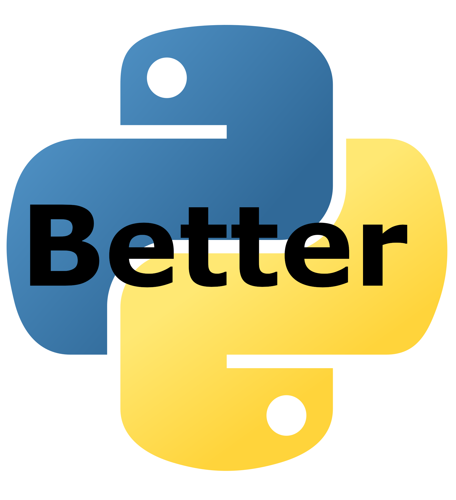

# BetterPy
BetterPy is a version of Python with some adjustments that can make it better for you. We wrote this in Python as a school project and it still is not done entirely

## Install
- Download the newest [release](https://sillycode.tech/software?Desktop:BetterPy) and go through the instalation process

<<<<<<< HEAD
## Syntax etc
.....

=======

>>>>>>> parent of 529eb22 (img geht wieder)
